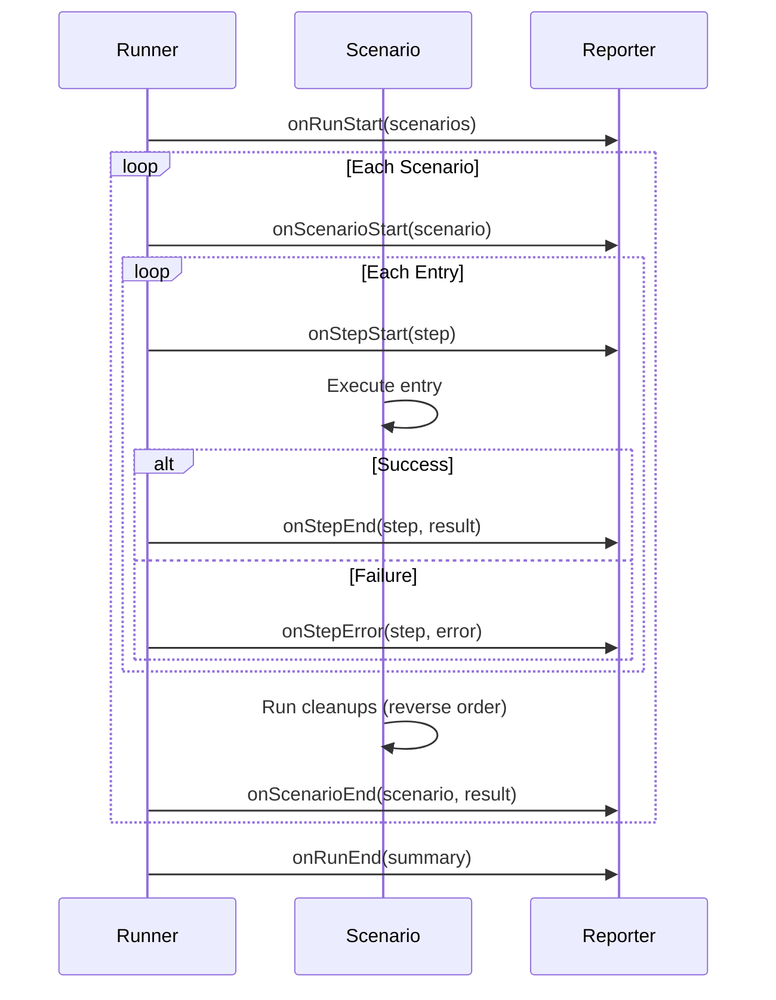

# Runner Layer

The Runner layer executes scenario definitions and orchestrates the test
lifecycle. It coordinates between scenarios, entries, and reporters.

## Design Philosophy

### Definition-Execution Separation

The Runner receives immutable `ScenarioDefinition` objects from the Builder. It
never modifies definitions — only reads and executes them.

### Event-Driven Reporting

The Runner emits lifecycle events to the Reporter rather than formatting output
directly. This enables:

- Multiple output formats from the same execution
- Real-time streaming of results
- Custom reporters without modifying Runner

### Controlled Concurrency

The execution model provides two orthogonal controls:

- **maxConcurrency** - How many scenarios run in parallel
- **maxFailures** - When to stop on failures

## Core Concepts

### Execution Lifecycle



### Entry Execution Order

1. Entries execute in definition order
2. Each entry receives context with previous results
3. On failure, remaining entries are skipped
4. Cleanups always run in reverse order

### Cleanup Guarantee

Cleanups are guaranteed to run even when:

- A step throws an error
- The scenario is aborted via signal
- A timeout occurs

Cleanup errors are collected but don't prevent other cleanups from running.

## API

### ScenarioRunner

The main execution engine. Instantiate and call `run()`.

### run(scenarios, options?)

Executes scenario definitions and returns a summary.

**Options:**

| Option           | Default       | Description                  |
| ---------------- | ------------- | ---------------------------- |
| `reporter`       | Silent        | Reporter to receive events   |
| `maxConcurrency` | 0 (unlimited) | Parallel scenario limit      |
| `maxFailures`    | 0 (continue)  | Stop after N failures        |
| `signal`         | None          | AbortSignal for cancellation |

**Concurrency modes:**

- `0` or undefined - Unlimited parallel execution
- `1` - Sequential execution
- `N` - At most N scenarios in parallel

**Failure modes:**

- `0` or undefined - Execute all scenarios
- `1` - Stop at first failure (fail-fast)
- `N` - Stop after N failures

### RunSummary

Returned from `run()`:

| Property    | Description               |
| ----------- | ------------------------- |
| `total`     | Total scenarios executed  |
| `passed`    | Successful scenario count |
| `failed`    | Failed scenario count     |
| `skipped`   | Skipped scenario count    |
| `duration`  | Total execution time (ms) |
| `scenarios` | Array of ScenarioResult   |

### ScenarioResult

Per-scenario result:

| Property     | Description                         |
| ------------ | ----------------------------------- |
| `metadata`   | Scenario name, location, options    |
| `status`     | "passed", "failed", or "skipped"    |
| `duration`   | Scenario execution time (ms)        |
| `steps`      | Array of StepResult                 |
| `error`      | Error if failed                     |
| `skipReason` | Reason string if skipped (optional) |

### StepResult

Per-step result:

| Property   | Description                  |
| ---------- | ---------------------------- |
| `metadata` | Step name, location, options |
| `status`   | "passed" or "failed"         |
| `duration` | Step execution time (ms)     |
| `value`    | Return value (if passed)     |
| `error`    | Error (if failed)            |

### Skip

The `Skip` class allows scenarios to be skipped programmatically. Throw `Skip`
from any resource, setup, or step function to skip the scenario.

```ts
import { Skip } from "@probitas/runner";

step("conditional step", (ctx) => {
  if (!ctx.resources.featureEnabled) {
    throw new Skip("Feature not enabled");
  }
  // ... step logic
});
```

Skipped scenarios:

- Stop execution immediately (remaining entries are not executed)
- Run all registered cleanups (like normal completion)
- Count as neither passed nor failed
- Trigger `onScenarioSkip` reporter event before `onScenarioEnd`

## Best Practices

1. **Use appropriate concurrency** - Sequential for debugging, parallel for
   speed
2. **Set reasonable timeouts** - Balance between slow tests and false positives
3. **Respect abort signals** - Check `ctx.signal.aborted` in long operations
4. **Leverage fail-fast** - Use `maxFailures: 1` during development
5. **Use Skip for conditional tests** - Skip scenarios based on environment or
   preconditions rather than failing

## Related

- [Architecture](./architecture.md) - Overall design
- [Builder](./builder.md) - Creating definitions
- [Reporter](./reporter.md) - Receiving execution events
- [Guide](./guide.md) - Practical examples
